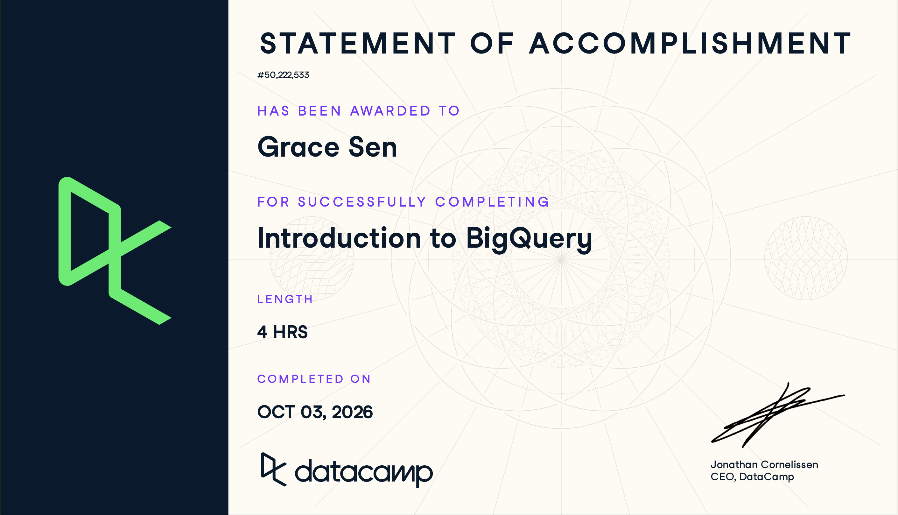

# **Course-Completion Evidence**



I completed the DataCamp **Introduction to BigQuery** course on 10/03/2026.

# Learning Notes and Key Takeaways

## BigQuery Architecture and Structure

### Main Ideas

BigQuery is a cloud-based data warehouse designed to store and analyze large amounts of data. Unlike a traditional database, its storage and computing resources are separated. This allows BigQuery to run large analytical queries without requiring users to manage physical servers.

### BigQuery Terminology and Procedures

- A **project** is the main workspace that contains BigQuery resources.
- A **dataset** organizes related tables.
- A **table** stores data in rows and columns.
- A **schema** defines column names and data types.
- BigQuery uses a serverless architecture, so Google manages the computing infrastructure.

### Important SQL Syntax

BigQuery identifies a table by using the full path `project.dataset.table` inside backticks.

### SQL Example

``` sql
SELECT *
FROM `project_name.dataset_name.orders`
LIMIT 3;
```

In this example, `project_name` is the Google Cloud project, `dataset_name` is the dataset, and `orders` is the table. The query displays all columns from the first three rows, which is useful when first exploring an unfamiliar table.

### CEP Application

BigQuery could provide one organized location for storing Avenue Shabu's sales, promotion, labor, and marketing data. Understanding the project and dataset structure would help our team locate the correct tables before beginning an analysis.

## Writing Queries and Data Types

### Main Ideas

This chapter reviewed SQL queries and introduced BigQuery data types. It also explained how to load outside data into BigQuery and work with dates, timestamps, arrays, and unstructured data.

### BigQuery Terminology and Procedures

- `LOAD DATA` imports data from a supported source into a BigQuery table.
- `DATE` stores calendar dates, while `TIMESTAMP` records an exact point in time.
- An **array** stores multiple values in one field.
- `UNNEST()` changes array elements into separate rows so they can be analyzed.

### Important SQL Syntax

- `SELECT` chooses columns from a table.
- `JOIN` combines related tables.
- `FORMAT_DATE()` displays a date in a chosen format.
- `CURRENT_TIMESTAMP()` returns the current date and time.
- `UNNEST()` makes values stored in an array available as rows.

### Example

``` sql
SELECT
  order_id,
  FORMAT_DATE('%B %Y', order_date) AS order_month,
  total_amount
FROM `project_name.dataset_name.orders`
WHERE order_date >= DATE_SUB(CURRENT_DATE(), INTERVAL 90 DAY);
```

This query returns orders from the most recent 90 days and displays the order month in an easier-to-read format.

### CEP Application

Date functions could help our team compare promotion and non-promotion periods. Joins could also connect sales data with marketing expenses or promotion records when the datasets share a common date or campaign field.

## Querying Data in BigQuery

### Main Ideas

This chapter introduced common table expressions, aggregate functions, and window functions. These tools help break a complicated analysis into smaller steps, summarize groups of records, and compare rows without removing the details in the original data.

### BigQuery Terminology and Procedures

- A **common table expression (CTE)** creates a temporary result that can be used later in the same query.
- An **aggregate function** summarizes several rows into one result.
- A **window function** calculates results across related rows while keeping each row visible.
- `QUALIFY` filters results after a window function is calculated.

### Important SQL Syntax

- `WITH` begins a CTE.
- `COUNTIF()` counts rows that meet a condition.
- `HAVING` filters grouped results.
- `RANK()` ranks records within a selected group.
- `LAG()` and `LEAD()` compare a row with earlier or later rows.

### Example

``` sql
WITH campaign_sales AS (
  SELECT
    campaign_name,
    SUM(revenue) AS total_revenue
  FROM `project_name.dataset_name.campaigns`
  GROUP BY campaign_name
)
SELECT
  campaign_name,
  total_revenue,
  RANK() OVER (ORDER BY total_revenue DESC) AS revenue_rank
FROM campaign_sales
QUALIFY revenue_rank <= 5;
```

The CTE first calculates total revenue for each campaign. The final query ranks the campaigns and keeps the five campaigns with the highest revenue.

### CEP Application

These functions could help rank Avenue Shabu's promotions, summarize results by promotion type, and compare campaign performance. They would also make it easier to identify which campaigns were associated with stronger sales results.

## Data Management and Optimization

### Main Ideas

The final chapter covered different join types, data manipulation language statements, and query optimization. A good BigQuery workflow should return the needed result while limiting unnecessary data processing.

### BigQuery Terminology and Procedures

- `INNER JOIN` keeps records that match in both tables.
- `LEFT JOIN` keeps every record from the left table and matching records from the right table.
- Data manipulation language (**DML**) statements change data stored in a table.
- Query optimization improves speed and reduces the amount of data processed.

### Important SQL Syntax

- `INSERT` adds new records.
- `UPDATE` changes existing records.
- `DELETE` removes records that meet a condition.
- `MERGE` combines insert, update, and delete logic.
- Selecting only needed columns and filtering early can reduce query cost.

### Example

``` sql
SELECT
  s.sale_date,
  s.revenue,
  p.campaign_name,
  p.marketing_cost
FROM `project_name.dataset_name.sales` AS s
LEFT JOIN `project_name.dataset_name.promotions` AS p
  ON s.sale_date = p.promotion_date
WHERE s.sale_date >= DATE_SUB(CURRENT_DATE(), INTERVAL 90 DAY);
```

This query combines recent sales with promotion information. It selects only the columns needed for the analysis and filters the date range to avoid processing unnecessary data.

### CEP Application

This approach could help our team combine restaurant sales, campaign expenses, and promotion records. The result could be used to calculate promotional lift, contribution margin, and return on marketing investment for AO5.

# Overall Reflection and Future Reference

The most useful part of this course was learning how BigQuery organizes large datasets and supports more advanced analysis. SQL provides the language for asking questions, while BigQuery provides the cloud environment for storing data and running those queries at scale. I found arrays, window functions, and query optimization more challenging because they require more planning than a basic `SELECT` statement.

BigQuery could support digital marketing and CEP analysis by combining data from different sources, summarizing campaign results, and comparing performance across time periods. I will probably review the full table-path format, `UNNEST()`, CTEs, window functions, and optimization practices when working on future projects.

# Appendix: Publication Links

- [GitHub Repository](https://github.com/gracesen/IBM-6500-SQL-Learning-Portfolio)

- [Published Introduction to BigQuery Report](https://gracesen.github.io/ibm-6500-sql-learning-portfolio/introduction-to-bigquery.html)
